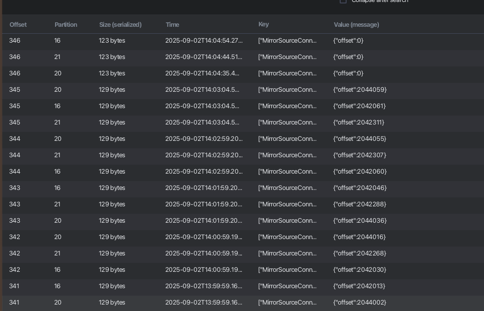

# Introduction

Hello, this is my first article on this site, and I want to start with Kafka MirrorMaker and a small life hack that helped me in one particular case.

It was a sunny day when I received a task to fix a replication issue between two topics in a different Kafka cluster connected to MM2. At first, I got stuck due to the lack of documentation and even considered removing all topics and restarting replication from scratch… really.

But then my colleague and I finally found the issue - and it wasn’t quite obvious. That’s why I decided to write this article: to help others who might face similar problems.

So, let’s start from scratch 🙂

We have two Kafka


And we want to use **Kafka MirrorMaker 2 (MM2)** to replicate data between Kafka clusters (AWS MSK, self-hosted, etc.).

And minimal configuration looks like this:

```
hello->world.enabled: true
world->hello.enabled: true

hello->world.topics: >-
  first.topic,
  second.topic
world->hello.topics: >-
  first.topic,
  second.topic
```

After replication, the topics appear as expected:


Looks good. But what if something goes wrong and you need to reset offsets for a specific topic so replication starts from the beginning?


At first, you might think: - I’ll just delete the topic on the destination cluster.

Well... nope 🙂

MM2 will recreate the topic, but it will not replay messages from the beginning. That’s because offsets are tracked in MM2’s internal state. (_Even if logs show auto.offset.reset=earliest_)


# Searching

If you search the official MM2 docs for “reset offsets” you won’t find a clear answer, or maybe I can't find this 😁

To fix this, let’s quickly review the internal topics MM2 creates:

```
mm2-configs.<CLUSTER_NAME>.internal
mm2-offset-syncs.<CLUSTER_NAME>.internal
mm2-offsets.<CLUSTER_NAME>.internal
mm2-status.<CLUSTER_NAME>.internal
```

📌 `mm2-configs.<CLUSTER_NAME>.internal`
- Stores replication config snapshots (topics, groups, settings).
- Keeps tasks consistent after restarts.

📌 `mm2-offset-syncs.<CLUSTER_NAME>.internal`
- Stores offset mappings between source and target consumer groups.
- Example: offset 1200 in source -> offset 1187 in target.
- Critical for failover without message loss or duplication.

📌 `mm2-offsets.<CLUSTER_NAME>.internal`
- Stores replicated consumer offsets from the source cluster.
- Essentially a checkpoint of where consumer groups are in the source.
- This is the topic we’ll use to reset offsets.

📌 `mm2-status.<CLUSTER_NAME>.internal`
- Tracks status of connectors and tasks (heartbeats, errors, etc.).
- Useful for debugging and monitoring.

For our case, the important one is `mm2-offsets.<CLUSTER_NAME>.internal`

Here’s what it looks like (_using KafkaIO to visualize_):


# Resetting

There’s a good [blog post](https://javier.monton.info/blog/kafka-connect-mm2-offset-management) on this topic, but in my testing, their advice about using a null offset didn’t work.

So, I prepared my steps to correctly reset messages for specific topic:

1. Stop MM2 replication
2. Manually remove topic from the destination cluster (_it's just to sync all messages without duplications if you already have some messages inside_)
3. Open the `mm2-offsets.<CLUSTER_NAME>.internal` topic
4. Find the latest message related to your topic with offset


5. Push the same message to the same partition with `{"offset":0}`


Yes, I tried with `null` first, but nothing happen :)

6. Start MM2 replication

After these steps, MM2 created the topic and synced all messages starting from the first one

P.S. This works when your topics are not compacted - just send `0` to all partitions.



# Conclusion

Resetting offsets in MirrorMaker 2 isn’t as simple as deleting a topic.

Because MM2 tracks offsets in its internal state, you need to reset them manually in mm2-offsets.<CLUSTER_NAME>.internal.

The quick recipe:
- Stop MM2
- Overwrite offset record with `{"offset": 0}`
- Restart MM2

And your topic will re-replicate from the beginning 🚀

Feel free to share your comments below!

Thanks